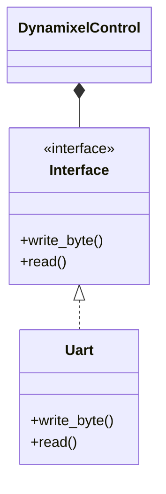

# dynamixel-rs
[](https://github.com/chama1176/dynamixel-rs/actions/workflows/rust.yml)

## Class Diagram


## Get started
For generate documentation.
```bash
cargo doc --open
```

### For Linux

```
sudo gpasswd -a ユーザ名 dialout
```

```
sudo chmod 666 /dev/ttyUSB0
```

```
cat /sys/bus/usb-serial/devices/ttyUSB0/latency_timer
```
