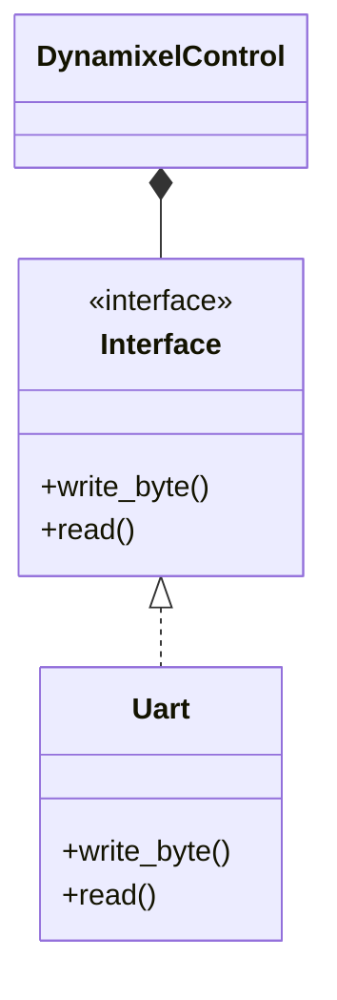

# dynamixel-rs
[](https://github.com/chama1176/dynamixel-rs/actions/workflows/rust.yml)

## Class Diagram

```mermaid
classDiagram
    class DynamixelControl{
    }
    DynamixelControl *-- Interface

    class Interface {
        <<interface>>
        +write_byte()
        +read()
    }
    class Uart {
        +write_byte()
        +read()
    }
    Interface <|.. Uart

```

## How to 
For generate documentation.
```bash
cargo doc --open
```